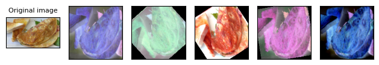
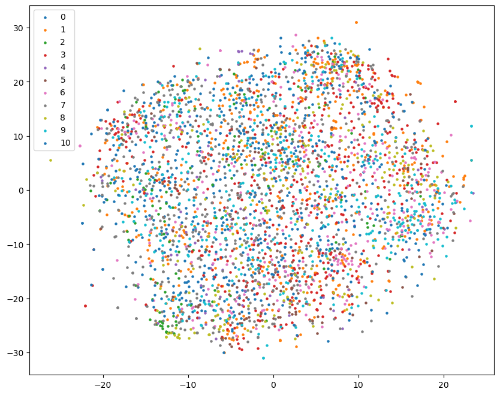
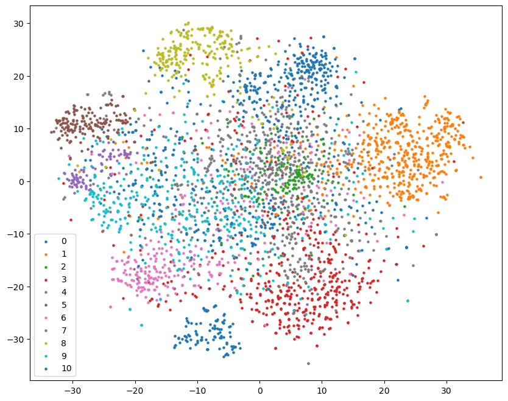
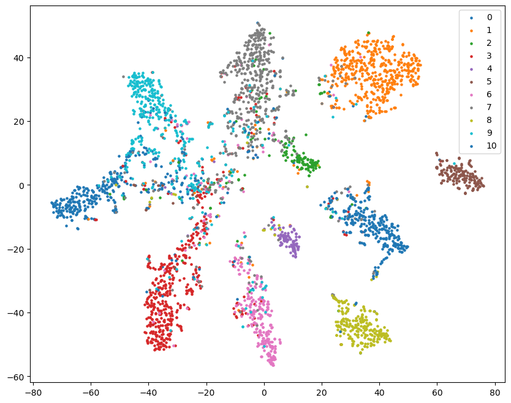

# Image Classification

- Train：10000张标记图片，11个类别
- Valid：3643张标记图片
- Test：3000张未标记图片

# Baselines

- Simple(0.637)

- Medium(0.700)

- Strong(0.814)

- Boss(0.874)

# Results

- sample code (0.59266)
- 加入train_transform并训练40个epoch达到medium(0.72400)
- 增加训练轮数到300个epoch，同时损失函数加入LabelSmoothing、增加Dropout层、使用学习率调整策略，最后根据提示在Test时，使用了Test Time Augmentation，达到strong(0.82133)

- 根据提示，boss需要交叉验证和集成模型，后面有空补完…
- 另外，助教有提到可以使用不带预训练参数的经典网络，如ResNet、VGG等，但是实验下来发现结果并没有强于作业提供的网络，是训练时间太短的原因？


# GradeScope

## Q1 Augmentation Implementation

在HW3中，我们使用了``torchvision.transforms``来进行图形变换，具体代码如下

```
train_tfm = transforms.Compose([
	# Resize image into a fixed shape (height = width = 128)
	transform.Resize((128, 128)),
	# You may add some transforms here
	
	# ToTensor() should be the last one of the transforms
	transforms.ToTensor(),
])
```

关于``torchvision.transforms``的使用，可以参考这篇博客[torchvision.transforms 常用方法解析]([torchvision.transforms 常用方法解析（含图例代码以及参数解释）_torchvision 斜切-CSDN博客](https://blog.csdn.net/weixin_42426841/article/details/129903800))

部分变换效果如下(变换之后模型还能认出来也挺牛的)



## Q2 Visualization

这里我使用了在Private上得分最高的Strong模型作可视化

依次为初始状态，CNN层，FC层的可视化

分类的结果从图上看是比较好的



​	

​	

​	