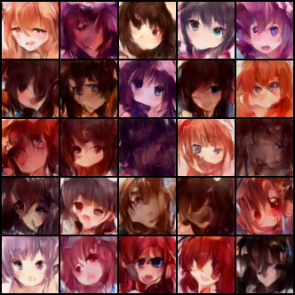
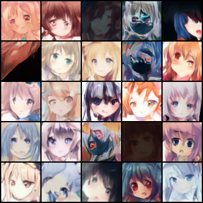

HW6没有kaggle提交，并且评分基于线上系统，因此本次作业结果以主观评价为主。

# Anime face generation

Train: 71314 pics

Test: generate 1000 pics

# Baselines

| Name   | FID        | AFD      |
| ------ | ---------- | -------- |
| Simple | &lt;=30000 | &gt;=0   |
| Medium | &lt;=12000 | &gt;=0.4 |
| Strong | &lt;=10000 | &gt;=0.5 |
| Boss   | &lt;=9000  | &gt;=0.6 |

# Results
## Simple

只能说不太拟人

## Medium

增加训练时长和数据增强

我们可以看到人脸的质量是有所上升的，但数据增强似乎起到了反作用？

# Strong

。。。

## Boss

。。。