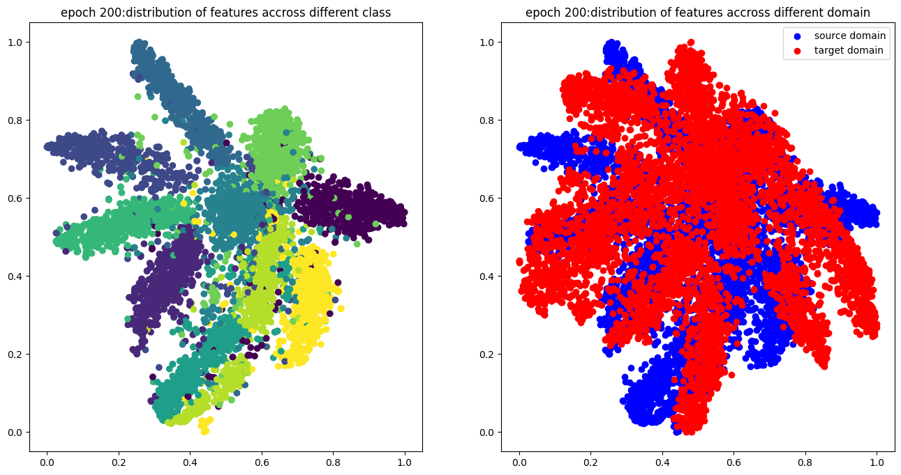
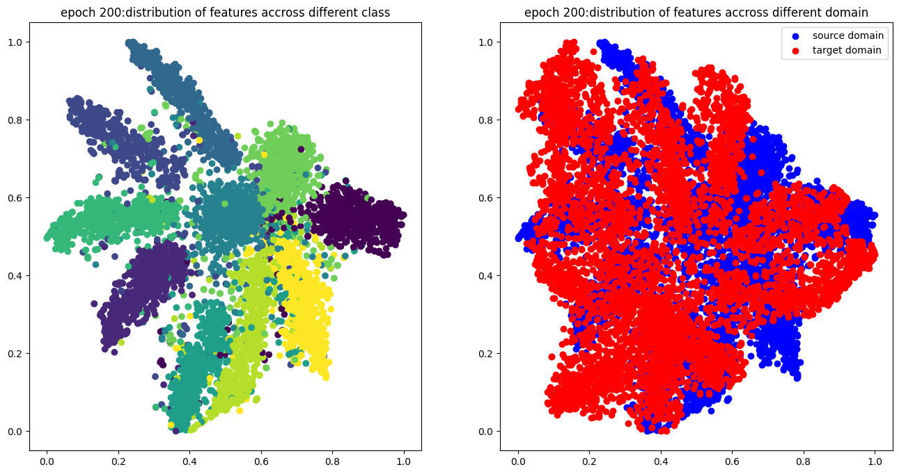
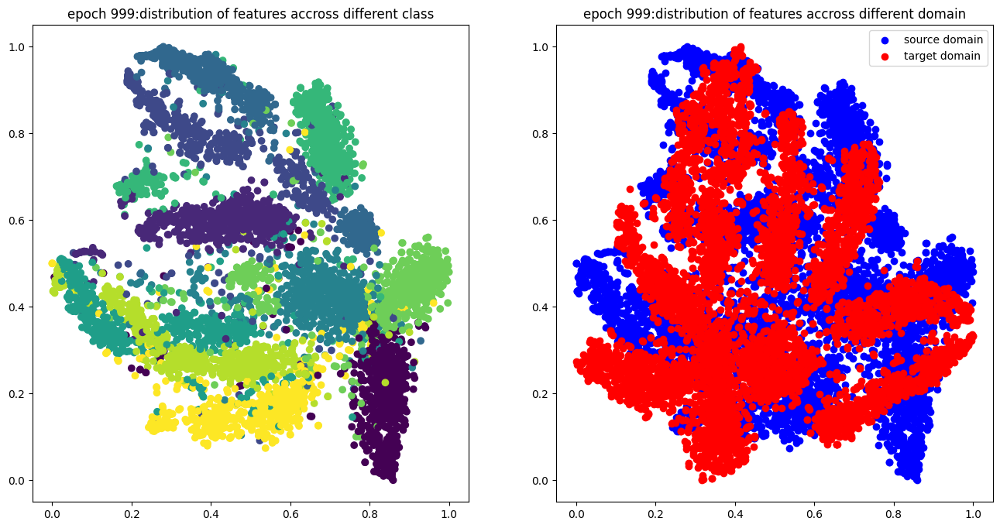

# Domain Adaption

- Label: 10 classes
- Training: 5000(32, 32) RGB real imgs (with label)
- Testing: 100000(28, 28) gray scale drawing imgs 


# Baselines

以kaggle为准

- Simple(0.44012)
- Medium(0.65928)
- Strong(0.75518)
- Boss(0.80794)

# Results

## Simple(0.49804)

运行代码即可

## Medium(0.68844)
调整$\lambda$的取值随训练过程改变，训练1000个epoch
$$
\lambda = \log(1.02 + \frac{1.7 \times \text{epoch}}{\text{num\_epochs}})
$$


## Strong(0.78734)
修改$\lambda$的公式
$$
\lambda = \frac{2}{1 + \exp(-10 \times \frac{\text{epoch}}{\text{num\_epochs}})} - 1
$$


得分为0.71848

在此基础上，调整学习率

|  LR  | Private Score |
| :--: | :-----------: |
| 1e-3 |    0.73916    |
| 2e-3 |    0.67038    |
| 1e-4 |    0.73008    |

效果一般

重新调整$\lambda$为
$$
\lambda = ( \frac{2}{1 + \exp(-10 \times \frac{\text{epoch}}{\text{num\_epochs}})} - 1 ) \times 2
$$


得分为0.75222，增加训练轮数至2000epoch，得分0.78734

## Boss(0.82726)

观察Stong模型的loss下降过程，考虑增加学习率调度

```python
optimizer_F = optim.Adam(feature_extractor.parameters(), lr=1e-3)
optimizer_C = optim.Adam(label_predictor.parameters(), lr=1e-3)
optimizer_D = optim.Adam(domain_classifier.parameters(), lr=1e-3)

scheduler_F = optim.lr_scheduler.ReduceLROnPlateau(optimizer_F, 'min', factor=0.9, patience=50, threshold=0.0001, threshold_mode='rel', cooldown=0, min_lr=1e-5, eps=1e-8)
scheduler_C = optim.lr_scheduler.ReduceLROnPlateau(optimizer_C, 'min', factor=0.9, patience=50, threshold=0.0001, threshold_mode='rel', cooldown=0, min_lr=1e-5, eps=1e-8)
scheduler_D = optim.lr_scheduler.ReduceLROnPlateau(optimizer_D, 'max', factor=0.9, patience=50, threshold=0.0001, threshold_mode='rel', cooldown=0, min_lr=1e-5, eps=1e-8)

...

    train_D_loss, train_F_loss, train_acc = train_epoch(source_dataloader, target_dataloader, lamb=2*lamb)
    
    scheduler_D.step(train_D_loss)
    scheduler_F.step(train_F_loss)
    scheduler_C.step(train_acc)
...
```


# Grade Scope

可视化代码参考[机器学习手艺人](https://mp.weixin.qq.com/s/T2XtRLJSb3oIvi4jFl8GRw)

## Strong





## Boss







