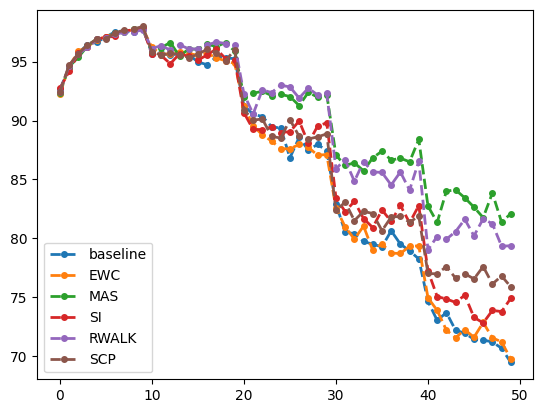

# Life-long Learning

本次作业无kaggle评分，完成代码文件的TODO后运行即可

```python
  for data in self.dataloader:
    self.model.zero_grad()
    output = self.model(data[0].to(self.device))
    ################################################################
    #####  TODO: generate Omega(Ω) matrix for MAS.  #####   
    ################################################################
    ################################################################
    l2_norm = output.norm(2, dim=1).pow(2).mean()
    l2_norm.backward()   
    for n, p in self.model.named_parameters():                    
          precision_matrices[n].data += p.grad.data ** 2 / num_data
```

运行结果如图

