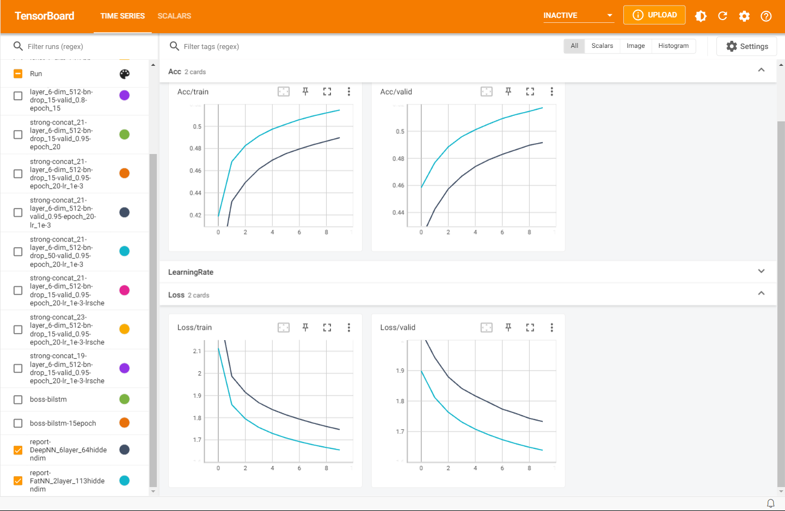
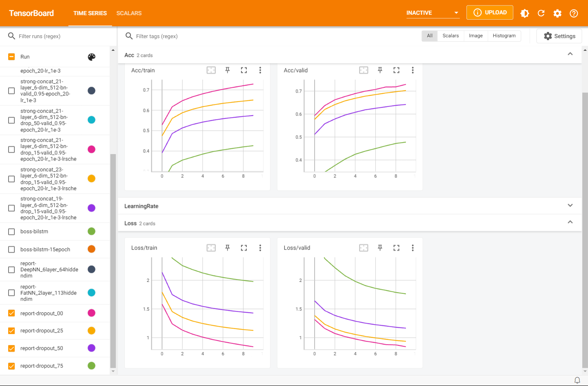
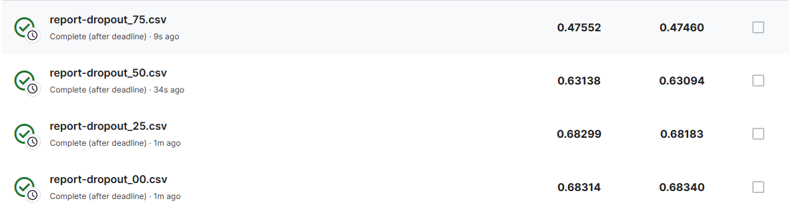

# Baselines

- Simple(0.49798): sample code
- Medium(066440): concat n frames, add layers 
- Strong(0.74977): batchnorm, dropout
- Boss(0.83017): sequence-labeling(RNN)

# Submissions

- Sample code(0.49714/0.49739)
- Medium: concat=15/layers=6/dim=512(0.68314/0.68340)
- Strong: concat_23-layer_6-dim_512-bn-drop_15-valid_0.95-epoch_20-lr_1e-3-lrsche(0.74901/0.74863)

# Report

## Q1

训练中浅层的网络表现出了更好的效果，有点神奇了



找了一下，可能的解释是


# Q2

不同dropout比率的实验

超参数如下，仅修改了``drop_out``

```python
# data prarameters
# TODO: change the value of "concat_nframes" for medium baseline
concat_nframes = 15   # the number of frames to concat with, n must be odd (total 2k+1 = n frames)
train_ratio = 0.75   # the ratio of data used for training, the rest will be used for validation

# training parameters
seed = 1213          # random seed
batch_size = 512        # batch size
num_epoch = 10         # the number of training epoch
learning_rate = 1e-4      # learning rate
drop_out = 0.75
model_path = './report_dropout_model.ckpt'  # the path where the checkpoint will be saved
run_name = 'report-' + 'dropout_75'
prediction_name = run_name + '.csv'

# model parameters
# TODO: change the value of "hidden_layers" or "hidden_dim" for medium baseline
input_dim = 39 * concat_nframes  # the input dim of the model, you should not change the value
hidden_layers = 6          # the number of hidden layers
hidden_dim = 512           # the hidden dim
```

实验记录如下



kaggle结果

