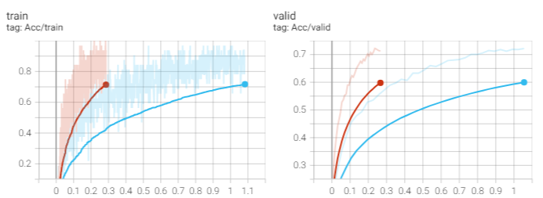

# Speaker Identification

- Train：56666个带标签的音频特征
- Test：4000个无标签的音频特征

# Baselines

- Simple(0.66025)
- Medium(0.81750)
- Strong(0.88500)
- Boss(0.93) PDF没说，根据网上资料确定的

# Results

## Simple(0.65675)

运行所给代码即可

## Medium(0.84000)

根据所给提示，修改了``d_model``、``nheand``以及``pred_layer``的网络结构

```python
def __init__(self, d_model=512, n_spks=600, dropout=0.1):
    super().__init__()
    # Project the dimension of features from that of input into d_model.
    self.prenet = nn.Linear(40, d_model)
    # TODO:
    #   Change Transformer to Conformer.
    #   https://arxiv.org/abs/2005.08100
    self.encoder_layer = nn.TransformerEncoderLayer(
        d_model=d_model, dim_feedforward=256, nhead=16
    )
    # self.encoder = nn.TransformerEncoder(self.encoder_layer, num_layers=2)

    # Project the the dimension of features from d_model into speaker nums.
    self.pred_layer = nn.Sequential(
        nn.Linear(d_model, 2*d_model),
        nn.Sigmoid(),
        nn.Dropout(dropout),
        nn.Linear(2*d_model, n_spks),
    )
```

由于tensorboard加载数据太慢，让我误以为kaggle的训练记录没有保存，于是在本地又训练了一遍。可以看到二者时间差距还是比较明显的(主要是我的太捞了，感谢kaggle的免费GPU)。另外，虽然代码完全一致，但本地训练结果的得分为0.83925，略低于kaggle的结果，看起来除了超参数以外，还有其他因素在影响神经网络的训练。



## Strong(0.89775)

根据作业提示，将``encode_layer``中的``transformer``改为``conformer``架构即可实现。由于本人代码水平有限，我直接使用了[torchaudio](https://pytorch.org/audio/stable/generated/torchaudio.models.Conformer.html#torchaudio.models.Conformer)提供的模块进行实现。

```python
# Use Conformer output ((batch size, length, d_model),(length))
self.encoder_layer = conformer.Conformer(
                input_dim=d_model,
                num_heads=16,
                ffn_dim=2048,
                num_layers=1,
                depthwise_conv_kernel_size=31,
                dropout=dropout,
                use_group_norm=False,
                convolution_first=False,
)
```

## Boss(0.96100)

PDF对Boss的提示是Self-Attention Pooling和Additive Margin Softmax，但我没做这两个。有人提到将``pred_layer``改为单层网络可以大大提升模型效果，而结果也证实了这一点。

```python
# Project the the dimension of features from d_model into speaker nums.
self.pred_layer = nn.Sequential(
# 			nn.Linear(d_model, 2*d_model),
# 			nn.Sigmoid(),
# 			nn.Dropout(dropout),
# 			nn.Linear(2*d_model, n_spks),
    nn.Linear(d_model, n_spks)
)
```

绿线为单层网络


# GradeScope

## Q1&2

> 介绍一种transformer的变体，并用图片辅助讲解网络结构
>
> 特定情况下的优势


### SpecAug

数据增强

### 卷积下采样

在Conformer模型中，卷积下采样（Convolutional Subsampling）主要有两个目的：

1. **降低计算复杂性**：通过减少序列长度，卷积下采样可以显著降低模型的计算复杂性。这是因为自注意力层的计算复杂性与序列长度的平方成正比。通过减少序列长度，我们可以使模型更快地处理长序列。

2. **捕捉局部信息**：卷积下采样不仅可以减少序列长度，还可以帮助模型捕捉序列中的局部信息。这是因为卷积操作可以捕捉输入中的局部模式。通过在下采样阶段使用卷积，我们可以使模型在处理更高级别的信息之前，先捕捉到这些局部模式。

这和池化类似，但又有所不同，具体可参照[深度学习 - 池化与下采样的步幅 - 交叉验证 (stackexchange.com)](https://stats.stackexchange.com/questions/387482/pooling-vs-stride-for-downsampling)

### Linear & Dropout

线性层将采样后的数据进行映射，失活层防止过拟合

### Conformer Block

通过多头注意力和卷积，Conformer同时关注全局和局部信息。层归一化除了归一化本身的好处，相较于批归一化，它不依赖批次的其他样本，在每个样本上独立进行，因此更适合小批次数据和变长序列的任务。同时，Block中的每个模块都使用了残差连接，这缓解了梯度消失的问题，使得梯度可以被反向传播至较浅的层，让深层网络成为可能。