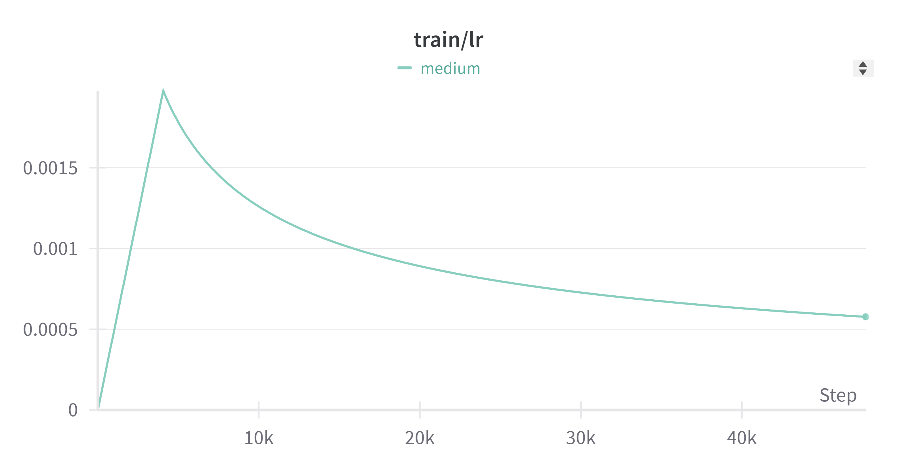
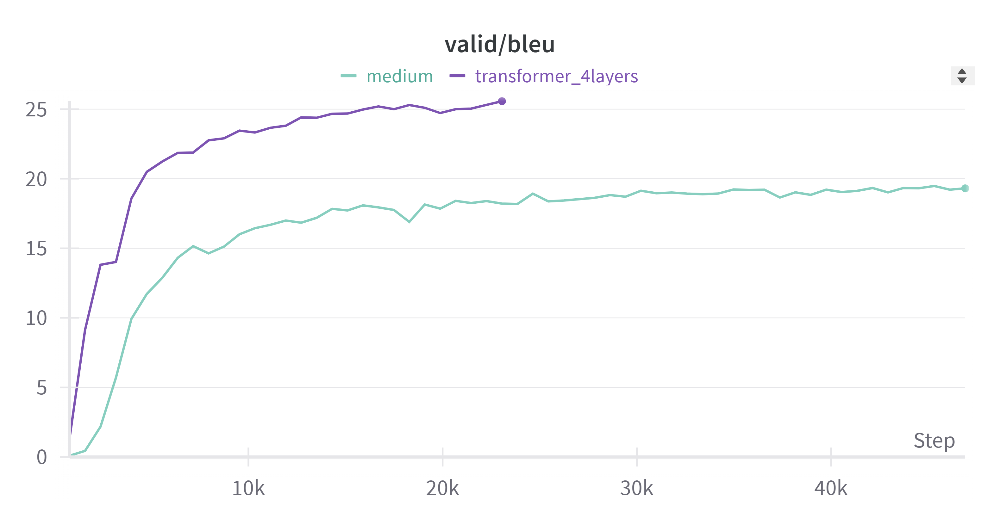
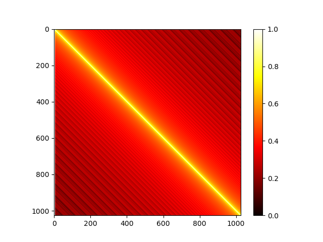
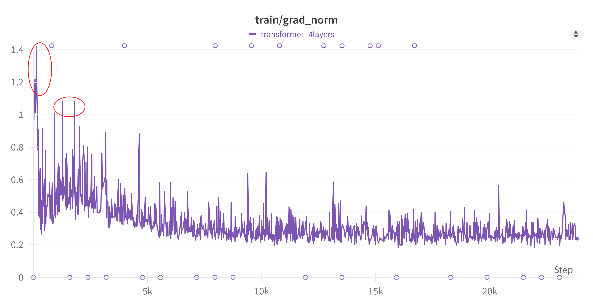

HW5没有kaggle的提交地址，因此只关注本地的验证集分数，即BLEU

# Machine Translation

- Paired Data
	- TED2020
		- Raw:400726(sentences)
		- Processed:394052(sentences)
	- en和zh两个版本
- Monolingual Data
	- 只有zh的数据

# Baselines

- Simple(15.05)
- Medium(18.44)

- Strong(23.57)
- Boss(30.08)

# Results

## Simple(14.62)
跑所给代码即可，但文件里的下载地址有点问题，修改为如下地址

```python
!pip install git+https://github.com/One-sixth/fairseq.git
```

## Medium(19.31)

增加epoch，同时修改学习率设置

```python
def get_rate(d_model, step_num, warmup_step):
    # TODO: Change lr from constant to the equation shown above
    #lr = 0.001
    lr = (d_model**(-0.5)) * min(step_num**(-0.5), step_num*(warmup_step**(-1.5)))
    return lr
```



## Strong(25.57)

更改为``transformer``架构，更少的epoch达到了更好的效果

```python
    # encoder decoder
    # HINT: TODO: switch to TransformerEncoder & TransformerDecoder
#     encoder = RNNEncoder(args, src_dict, encoder_embed_tokens)
#     decoder = RNNDecoder(args, tgt_dict, decoder_embed_tokens)
    encoder = TransformerEncoder(args, src_dict, encoder_embed_tokens)
    decoder = TransformerDecoder(args, tgt_dict, decoder_embed_tokens)
```

```python
arch_args = Namespace(
    encoder_embed_dim=256,
    encoder_ffn_embed_dim=1024,
    encoder_layers=4,
    decoder_embed_dim=256,
    decoder_ffn_embed_dim=1024,
    decoder_layers=4,
    share_decoder_input_output_embed=True,
    dropout=0.15,
)

# HINT: these patches on parameters for Transformer
def add_transformer_args(args):
    args.encoder_attention_heads=4
    args.encoder_normalize_before=True
    
    args.decoder_attention_heads=4
    args.decoder_normalize_before=True
    
    args.activation_fn="relu"
    args.max_source_positions=1024
    args.max_target_positions=1024
    
    # patches on default parameters for Transformer (those not set above)
    from fairseq.models.transformer import base_architecture
    base_architecture(arch_args)

add_transformer_args(arch_args)
```



# Gradescope

## Visualize Positional Embedding



具体解释见gradescope.ipynb

## Gradient Explosion



在梯度裁剪中，我们设置了``max_norm``为1，红圈圈出了两处，我们认为发生了梯度爆炸。